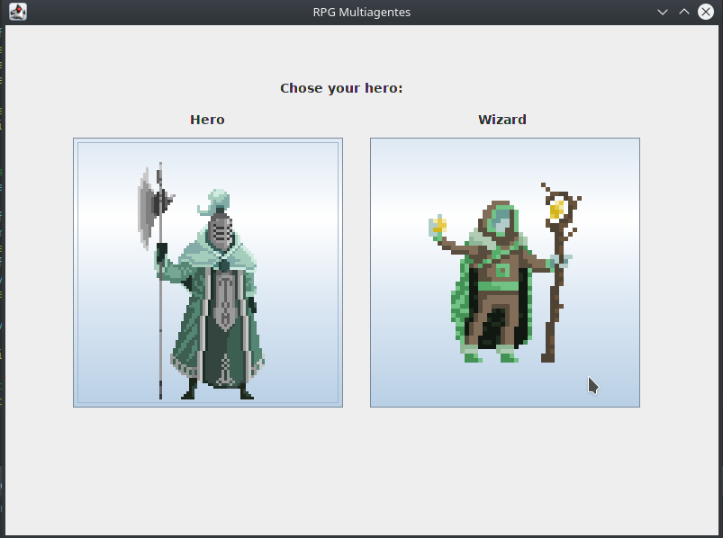
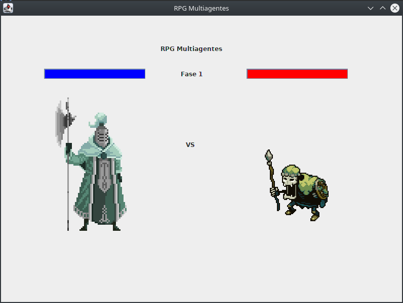
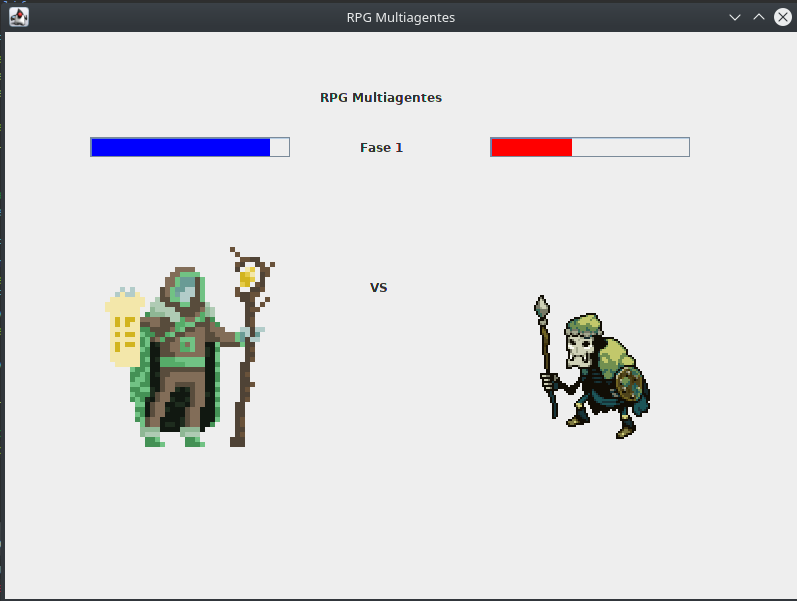

# Projeto: rpg-multiagentes

**Ezequiel de Oliveira dos Reis - 160119316**  
**Gabriel de Jesus Carvalho - 16/0120918**  
**Guilherme de Oliveira Aguiar - 160123119** 

# O que é?

Um simulador de rpg criado usando multiagentes, onde a base e um lutador que encontra várias fases, cada fase tem um monstro que é o chefe da fase, cada herói tem um curador que o acompanha durante as fases e cura até onde puder para fazê-lo vencer.

** Para executar configure seu eclipse e rode a classe main para ver os resultados imprimidos em console.

** Outra opção e executar a mainInterface para ter um resultado com melhor visualização, como os screenshots abaixo.

